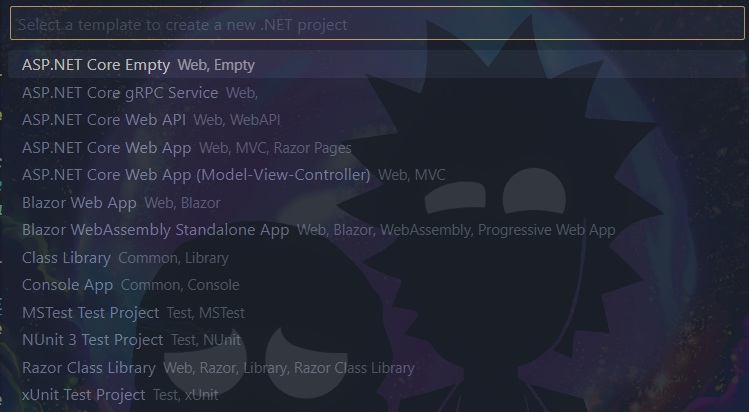

# Beginner Project Ideas:

> Before starting check out this video and follow along:
> This project is done in [WebApp](./WebApplication1/)
> [Create ASP.NET Core Web Application](https://youtu.be/dTIjAJO-tcQ?si=T_Si62nyrVLAkv7k)
> If you are like me and dont want to switch from VS Code, when creating the App use the `ASP.NET Core Web App` `Web, MVC, Razor Pages` option.
> 

1. To-Do List Web Application
   Tutorial: [Build a To-Do List App with ASP.NET Core MVC](https://youtu.be/ZypiARkybY0?si=WElseI9BdyuDjICE)
   Description: Create a simple web application where users can add, update, and delete tasks. Learn about CRUD operations, routing, and basic database interactions.

2. Weather Forecast Web App
   Tutorial: [Building a Weather App with ASP.NET Core 6, Weatherstack API, and Mapbox API](https://youtu.be/CUAKlck5Uv0?si=DLE8SUuyPWTK40n0)
   In this step-by-step tutorial, we'll guide you through the process of creating a Weather App using ASP.NET Core 6, C#, the Weatherstack API, and Mapbox API. By the end of this video, you'll have a functional Weather App that provides real-time weather information for the given location/city.

3. Blog or Forum Application
   Tutorial: [Build a Blog with ASP.NET Core MVC](https://www.youtube.com/watch?v=ZXdFisA_hOY)
   Description: Create a simple blogging platform where users can write posts, comment, and interact with each other. This project covers user authentication, CRUD operations, and basic user interaction.

4. Recipe Manager | E-commerce Website
   Tutorial: [Create a Recipe Manager with ASP.NET Core and Entity Framework](https://youtu.be/DFOUA_ViqUc?si=M1wt_Wwr5bej0Vlf)
   Description: Develop an application where users can manage and organize recipes. Learn about database relationships, data modeling, and more.

5. E-commerce Website
   Tutorial: Build an E-commerce Site with ASP.NET Core
   Description: Create a basic online store with product listings, shopping cart functionality, and checkout processes. This project involves working with databases, sessions, and user interactions.

---

> Tips for Following Video Tutorials:
> Pause and Code Along: Don’t rush through the tutorials. Pause the video at key moments and code along to fully understand the concepts.
> Experiment: After completing the tutorial, try to modify or add features to the project to solidify your understanding.

> Take Notes: Jot down important points or concepts you encounter during the tutorial for future reference.

---

These tutorials should give you a hands-on understanding of building web applications using C# and ASP.NET. Enjoy coding and building your projects!
